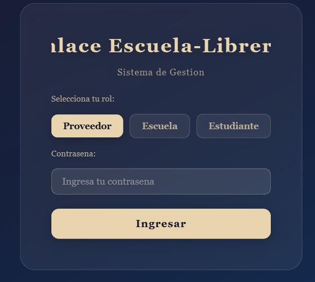
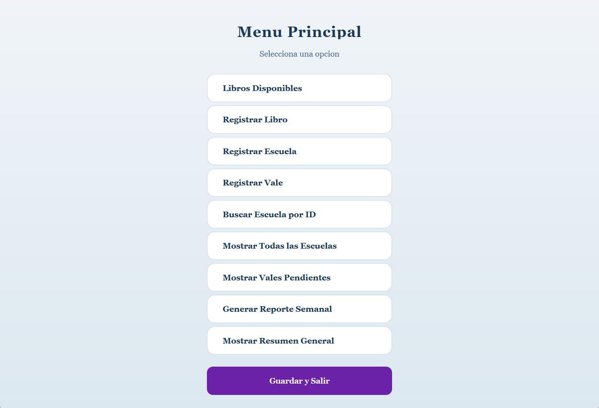
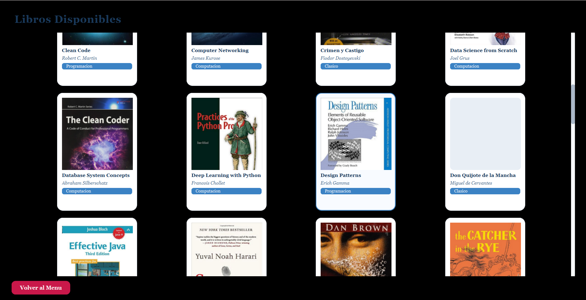
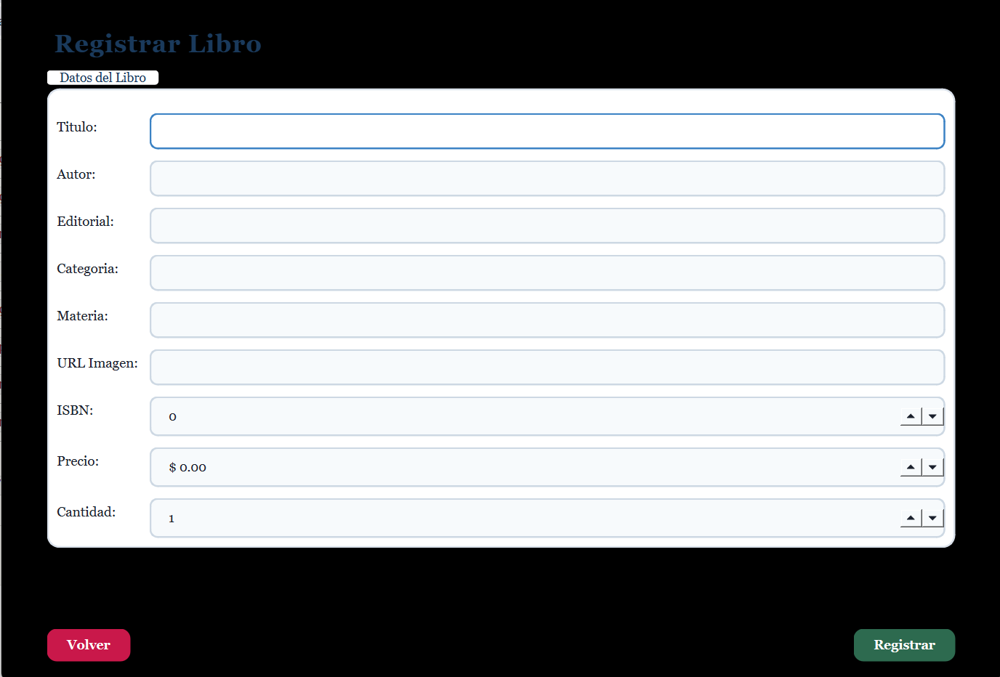
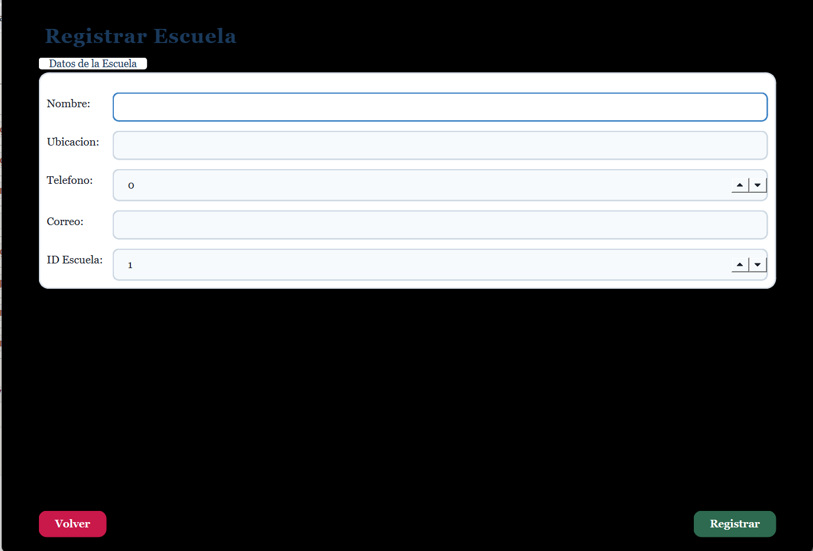
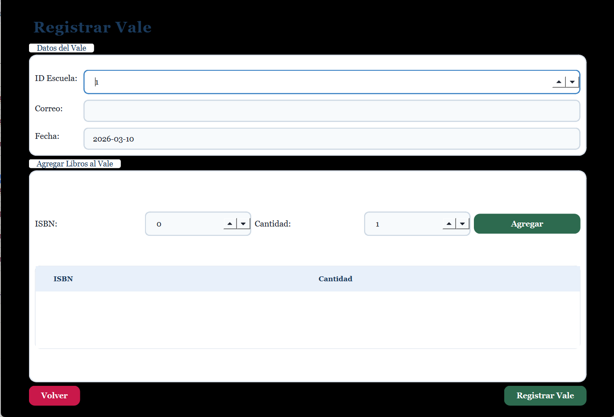
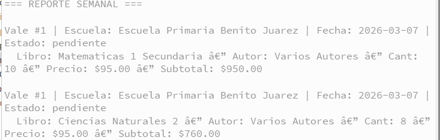

# 📚 Enlace Escuela-Librería

Sistema de gestión para librerías que distribuyen libros a escuelas. Permite registrar libros, escuelas y vales de pedido, con tres roles de acceso diferenciados, galería visual de libros con portadas y base de datos PostgreSQL.

Desarrollado en **C++17** con **Qt6** y **libpq**.

---

## 📸 Capturas de pantalla

### Inicio de sesión

> Pantalla principal con selección de rol y contraseña. Fondo oscuro degradado con tarjeta de vidrio translúcido.

### Menú principal

> Las opciones del menú cambian dinámicamente según el rol que inició sesión.

### Galería de libros

> Vista en cuadrícula con tarjetas de libros, portadas descargadas desde URL, título, autor y categoría.

### Registrar libro

> Formulario para agregar un nuevo libro al inventario con ISBN, precio, cantidad y URL de portada.

### Registrar escuela


### Registrar vale

> Permite agregar múltiples libros (por ISBN y cantidad) a un vale antes de guardarlo.

### Vales pendientes


### Resumen general


---

## ✨ Características

- **Galería visual** de libros con portadas cargadas desde URL usando `QNetworkAccessManager`
- **Tres roles de acceso** con menús dinámicos según el rol
- **Base de datos PostgreSQL** con conexión vía `libpq`
- **Vales de pedido** con múltiples libros por vale y seguimiento de estado
- **Reportes** semanales y resúmenes generales desde vistas SQL
- **Exportación CSV** del inventario como respaldo
- Interfaz con diseño moderno usando **Qt Stylesheets**
- Autenticación de usuarios con función SQL (`pgcrypto`)

---

## 👥 Roles de usuario

| Rol | Acceso |
|-----|--------|
| **Proveedor** | Gestión completa: libros, escuelas, vales, reportes y resúmenes |
| **Escuela** | Ver libros disponibles, pedir libros al proveedor, ver vales pendientes |
| **Estudiante** | Ver libros disponibles, pedir libros a la escuela |

---

## 🗂️ Estructura del proyecto

```
enlace-escuela-libreria/
├── main.cpp                  # Punto de entrada Qt
├── mainwindow.cpp/.h         # Interfaz gráfica (todas las pantallas)
├── mainwindow.ui             # Layout Qt Designer
├── SistemaGestion.cpp/.h     # Lógica de negocio principal
├── DatabaseManager.cpp/.h    # Conexión y operaciones PostgreSQL (libpq)
├── Libro.cpp/.h              # Clase Libro
├── Escuela.cpp/.h            # Clase Escuela
├── Vale.cpp/.h               # Clase Vale
├── Inventario.cpp/.h         # Gestión del inventario en memoria
├── CsvUtils.cpp/.h           # Utilidades CSV y sistema de archivos
├── CMakeLists.txt            # Configuración de compilación
├── data.txt                  # Scrip de postgre
└── data/                     # Carpeta generada automáticamente para CSV
```

---

## 🗄️ Base de datos

El sistema se conecta a una base de datos **PostgreSQL** llamada `enlace_libreria`.

### Tablas principales

| Tabla | Descripción |
|-------|-------------|
| `libros` | Catálogo de libros con ISBN, título, autor, precio, stock y URL de portada |
| `escuelas` | Escuelas registradas con nombre, ubicación, teléfono y correo |
| `vales` | Cabecera de los vales de pedido |
| `detalle_vale` | Libros incluidos en cada vale (ISBN, cantidad, precio unitario) |
| `usuarios` | Usuarios del sistema con rol y contraseña cifrada (`pgcrypto`) |

### Vistas SQL utilizadas

- `v_libros_disponibles` — libros con stock mayor a cero
- `v_reporte_semanal` — movimientos de los últimos 7 días
- `v_resumen_general` — estadísticas globales del sistema

### Funciones SQL

- `autenticar_usuario(correo, contrasena)` — valida credenciales con `crypt()`
- `siguiente_id_vale()` — genera el siguiente ID disponible para vales

---

## ⚙️ Requisitos

- **Qt 6** (Widgets + Network + LinguistTools)
- **PostgreSQL 18** (o ajustar `PG_ROOT` en `CMakeLists.txt`)
- **libpq** (incluida con PostgreSQL)
- **CMake ≥ 3.16**
- **Compilador C++17** (MSVC, GCC o Clang)

---

## 🚀 Compilación

### 1. Clonar el repositorio

```bash
git clone https://github.com/derekrex333/enlace-escuela-libreria.git
cd enlace-escuela-libreria
```

### 2. Ajustar la ruta de PostgreSQL

En `CMakeLists.txt`, modifica la variable `PG_ROOT` según tu instalación:

```cmake
set(PG_ROOT "C:/Program Files/PostgreSQL/18")
```

### 3. Configurar y compilar

```bash
mkdir build && cd build
cmake ..
cmake --build . --config Release
```

> En Windows, el archivo `libpq.dll` se copia automáticamente al directorio de build tras la compilación.

### 4. Configurar la base de datos

Crea la base de datos y las tablas en PostgreSQL antes de ejecutar el sistema. La cadena de conexión por defecto en `MainWindow.cpp` es:

```
host=localhost  port=5432  dbname=enlace_libreria  user=postgres
```

Puedes modificarla directamente en el constructor de `MainWindow`.

---

## 📦 Dependencias externas

| Dependencia | Uso |
|-------------|-----|
| `Qt6::Widgets` | Interfaz gráfica |
| `Qt6::Network` | Descarga de portadas desde URL |
| `libpq` | Conexión a PostgreSQL |

---

## 📝 Notas de desarrollo

- El inventario puede exportarse a `data/inventario.csv` desde el menú "Guardar y Salir"
- Las imágenes de portada se cargan de forma asíncrona; si la URL no está disponible se muestra "Sin imagen"
- La carpeta `data/` se crea automáticamente al iniciar si no existe

---

## 📄 Licencia

Este proyecto fue desarrollado con fines académicos.
